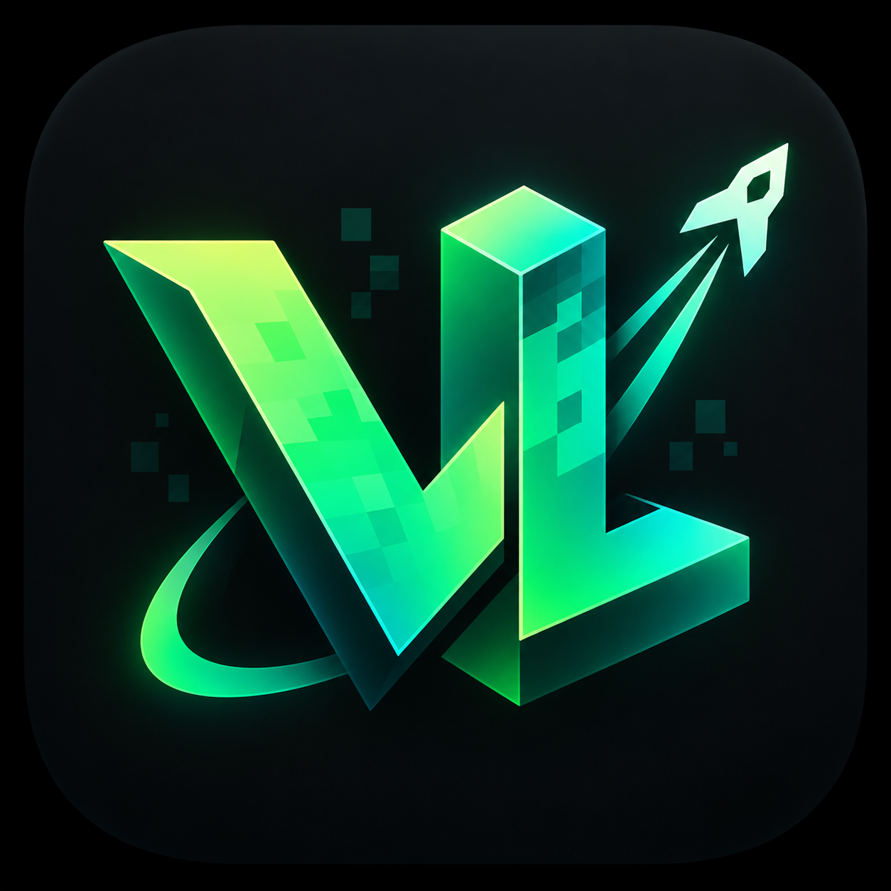

# VLzyLauncher

**VLzy Launcher** (VeryLazy Launcher) is an independent, unofficial Minecraft:
Java Edition launcher for Android, created and maintained by
[Nadzil123](https://github.com/Nadzil123).

## Download and install

**[Download an APK from Releases](https://github.com/Nadzil123/VLzyLauncher/releases)**

Open the release, expand **Assets**, and download the `.apk` for your device.
Open the downloaded APK on Android and allow installation from that source if
prompted. You do not need to build the source code to use the launcher.

The current alpha download supports **ARM64 (arm64-v8a)** devices. Read the
release notes for build type, compatibility and known limitations. For changes
between versions, see the [changelog](CHANGELOG.md).

## Features

- Create a local offline profile.
- Browse and download supported content through Modrinth.
- Install and launch Minecraft with configurable runtimes, renderers and controls.
- Use an English interface by default, with language selection available.

Microsoft sign-in is unavailable until further notice.
CurseForge is unavailable until further notice.

## Support and development

- [Report a problem or request a feature](https://github.com/Nadzil123/VLzyLauncher/issues)
- [Contribute code, documentation or translations](CONTRIBUTING.md)
- [Build from source](docs/BUILDING.md)

## Credits and license

VLzyLauncher is an independently maintained hard fork of
[ZalithLauncher2](https://github.com/ZalithLauncher/ZalithLauncher2), originally
developed by MovTery and contributors. See [upstream notices](UPSTREAM_NOTICE.md)
and the [GPL license](LICENSE) for attribution and redistribution terms.

VLzyLauncher is not affiliated with Mojang or Microsoft.
